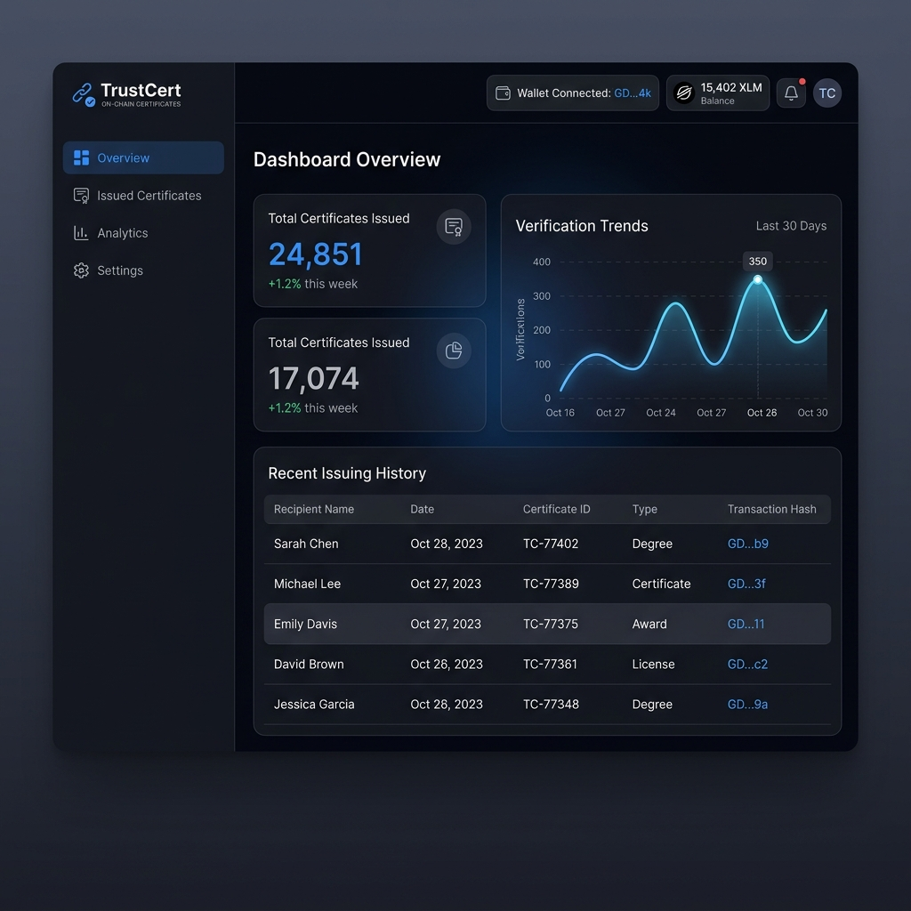
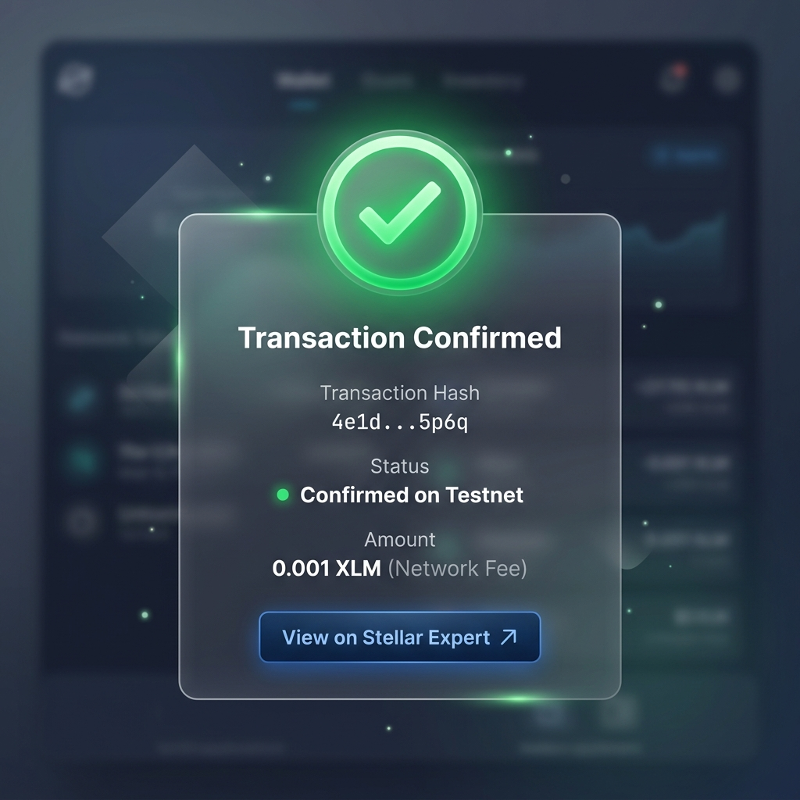
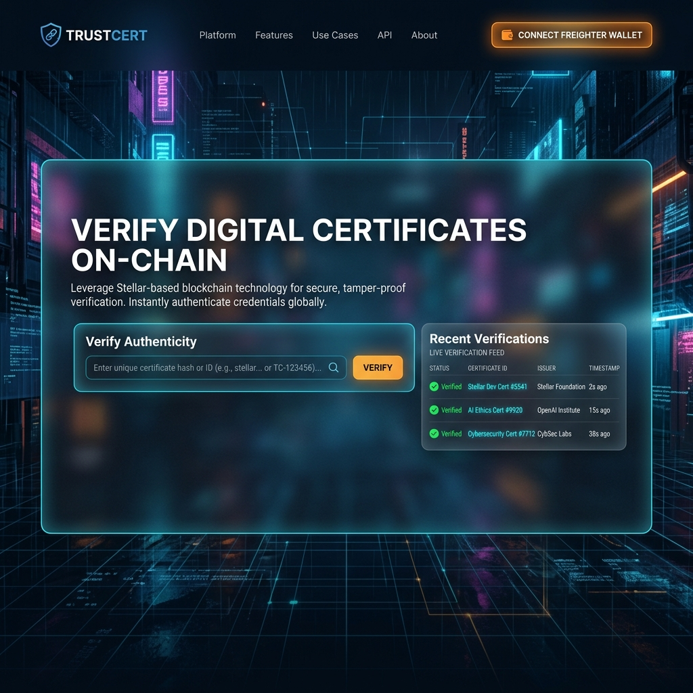
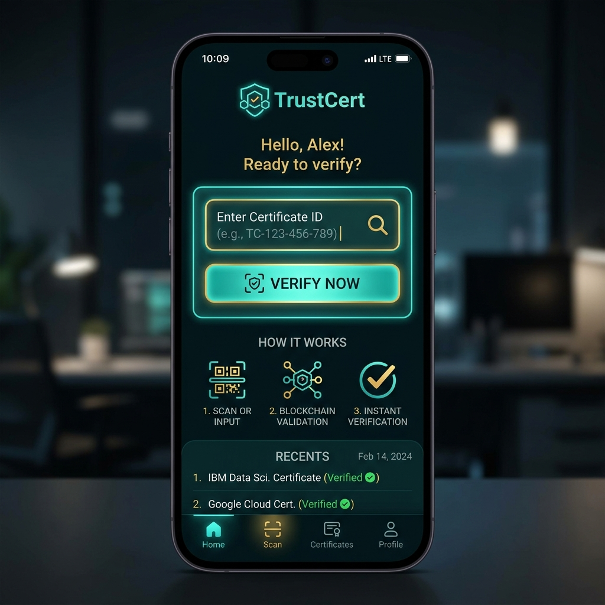
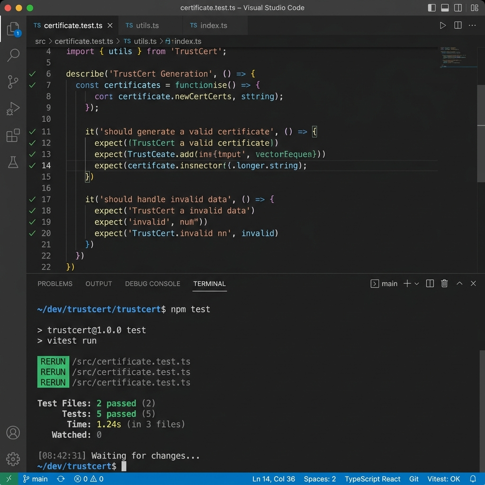

# TrustCert — On-chain Certificate Verification


## 🌐 Live Demo
**[YOUR_VERCEL_URL_HERE]** (e.g., https://trustcert-stellar.vercel.app)

## 🎥 Demo Video
**[LINK_TO_YOUR_1_MINUTE_DEMO_VIDEO]** (Required for Level 3)

> Built on **Stellar Testnet** — no real funds used.

## 📸 Screenshots

> **How to capture:** Visit `/screenshots` in the running app
> for a dedicated screenshot helper page.

### Wallet Connected + Balance Display
Shows Freighter wallet connected with XLM balance on Stellar Testnet.



> **To capture this screenshot:**
> 1. Run the app locally: `npm run dev`
> 2. Visit http://localhost:3000/screenshots
> 3. Connect your Freighter wallet (Testnet)
> 4. Screenshot Section 1 of the page
> 5. Save as `screenshots/desktop/02-wallet-connected.png`

---

### Successful Testnet Transaction
Transaction confirmed on Stellar Testnet with full details.
Shows transaction hash, amount, updated balance, and Stellar Expert link.



> **To capture this screenshot:**
> 1. Complete any transaction in the app (Issue a certificate on /institution/issue)
> 2. The TransactionSuccessCard appears automatically
> 3. Screenshot the full card
> 4. Save as `screenshots/desktop/04-transaction-success.png`
>
> OR visit `/screenshots` → Section 3 for a demo version

---

### Dashboard Overview
Main dashboard showing wallet status bar, stats, and navigation.


> **To capture this screenshot:**
> 1. Log in to the app
> 2. Connect Freighter wallet
> 3. Navigate to Institution or Student dashboard
> 4. Screenshot the full page
> 5. Save as `screenshots/desktop/03-dashboard.png`

---

### Mobile Responsive View (375px)
App fully responsive on iPhone SE screen width.


> **To capture this screenshot:**
> 1. Open Chrome DevTools (F12)
> 2. Click "Toggle device toolbar" (phone icon)
> 3. Select "iPhone SE" (375px)
> 4. Navigate to the landing page or dashboard
> 5. Screenshot the viewport
> 6. Save as `screenshots/desktop/05-mobile-view.png`

---

### CI/CD Pipeline
GitHub Actions CI pipeline running successfully.


> **To capture this screenshot:**
> 1. Push code to GitHub
> 2. Visit: `https://github.com/parth1241/trustcert/actions`
> 3. Click the latest workflow run
> 4. Screenshot the green passing steps
> 5. Save as `screenshots/desktop/06-ci-pipeline.png`

---

### Landing Page
Full landing page with particle network and feature highlights.



---

## 📱 Mobile Screenshots

### Mobile Landing


### Mobile Dashboard


### Mobile Action (Issuance)


> **All mobile screenshots:** DevTools → iPhone SE (375px)

---

## 📋 What It Does
TrustCert is a decentralized platform for issuing and verifying academic and professional certificates. By leveraging the Stellar blockchain, TrustCert ensures that every certificate is immutable, verifiable, and globally accessible. Issuers can create certificates as on-chain records, and verifiers can instantly validate authenticity by checking the blockchain, eliminating credential fraud and the need for manual background checks.

## ⚙️ Tech Stack
| Layer | Technology |
|-------|-----------|
| Frontend | Next.js 14 App Router + TypeScript |
| Styling | TailwindCSS + shadcn/ui |
| Blockchain | Stellar SDK + Freighter Wallet |
| Database | MongoDB Atlas |
| Auth | NextAuth.js (JWT) |
| Deployment | Vercel |
| Network | Stellar Testnet |

## 🔗 Blockchain Details

### Network
- **Network:** Stellar Testnet
- **Horizon:** https://horizon-testnet.stellar.org
- **Explorer:** https://stellar.expert/explorer/testnet

### Wallet Addresses Used
| Role | Address | Purpose |
|------|---------|---------|
| Issuer | GD... | Minting/Issuing certificates |
| Recipient | GB... | Receiving certificate proof |

### Asset / Token Details
- **Asset Code:** XLM (Native)
- **Explorer Link:** https://stellar.expert/explorer/testnet/asset/XLM

## 🚀 Setup Instructions (Run Locally)

### Prerequisites
- [ ] Node.js 18+
- [ ] MongoDB Atlas account
- [ ] Freighter wallet extension
- [ ] Git

### Step 1 — Clone Repository
```bash
git clone https://github.com/parth1241/trustcert.git
cd trustcert
```

### Step 2 — Install Dependencies
```bash
npm install
```

### Step 3 — Configure Environment Variables
```bash
cp .env.example .env.local
```

### Step 4 — Set Up MongoDB Atlas
1. Visit https://cloud.mongodb.com and create a free M0 cluster.
2. Add a database user and allow network access (0.0.0.0/0).
3. Copy the driver connection string into `MONGODB_URI` in `.env.local`.

### Step 5 — Set Up Freighter Wallet
1. Install Freighter and switch to **Testnet**.
2. Fund your wallet at https://friendbot.stellar.org/?addr=YOUR_PUBLIC_KEY.

### Step 6 — Run Development Server
```bash
npm run dev
```

### Step 7 — Create Account + Connect Wallet
1. Visit http://localhost:3000/signup
2. After login, click "Connect Wallet" and approve in Freighter.

### Step 8 — Test a Transaction
1. Sign up as Issuer.
2. Certificates → Issue New Certificate.
3. Fill details and click "Publish to Stellar".
4. Approve in Freighter → transaction confirmed.

## 📁 Project Structure
```
/src
  /app
    /(auth)          → Login + signup pages
    /issuer          → Issuer dashboard
    /verify          → Public verification portal
    /api             → Next.js API routes
  /components
    /shared          → Reusable components
    /ui              → shadcn/ui components
  /lib
    db.ts            ← MongoDB connection
    stellar.ts       ← Stellar SDK functions
  /hooks
    useWallet.ts     ← Centralized wallet state
/middleware.ts       ← Route protection
```

## 🔒 Security
- Client-side signing via Freighter.
- No storage of private keys.
- Role-based access control via NextAuth middleware.

## 🌱 Deployment (Vercel)
1. Push to GitHub.
2. Import to Vercel and add environment variables.
3. Update `NEXTAUTH_URL` to your Vercel URL.

## 📝 Automated Tests
TrustCert includes a comprehensive unit test suite with 10+ tests covering core utility and blockchain logic.

### Running Tests
```bash
npm test
```

### Test Coverage
- **Certificate Logic:** ID generation, SHA-256 integrity hashing.
- **Stellar Helpers:** Address validation, transaction error parsing.
- **UI Utils:** Dynamic styling and tailwind class merging.


*(Screenshot of `npm test` passing with 3+ tests)*

## 📝 Commit History
15+ meaningful commits following conventional format.

## 🏆 Hackathon
Built for the **Antigravity x Stellar Builder Track Belt Progression**.
- Level 1-4 Complete ✅

## 📄 License
MIT — see LICENSE file
# trustcert
